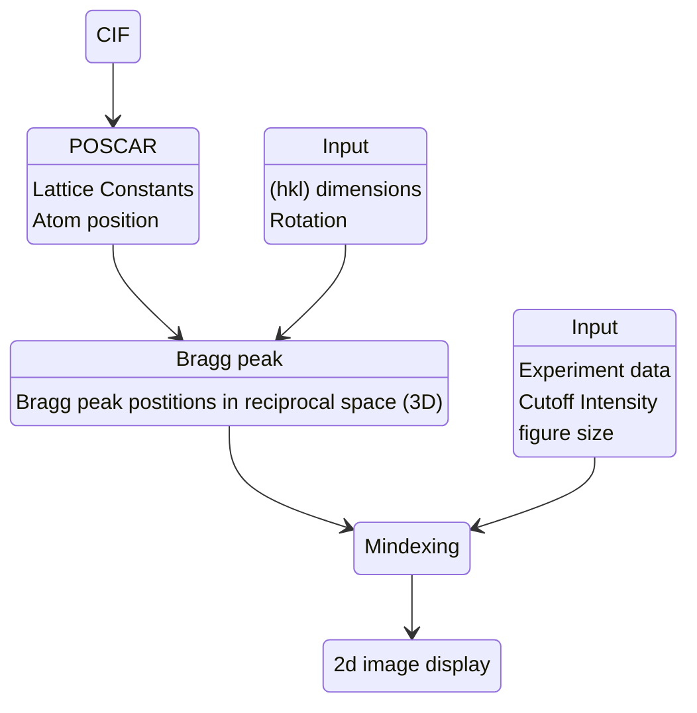

# GIWAXS index tool in Python

Zihan Zhang (zihan.zhang-1@colorado.edu) & Keith White (Keith.White@colorado.edu)

This is a python code to show the Bragg peak position and the Miller index on a 2D image (q$_{xy}$, q$_{z}$). The program is based on GIWAXS simulation tool. You need to [download](https://github.com/ZihanZhang-1996/2D_diffraction) diffraction.py to use the functions.

The Bragg peak position is calculated using cif file. They are labeled as (h k l) on the image and the experiment data is used as background for comparison.

<figure>
  
  <figcaption>Fig 1. This is the 2D image generated from the GIWAXS index tool. The background is simulation instead of experiment for illustration. The left row is not labeled because a cutoff of intensity is used to eliminate the peaks with low intensity.</figcaption>
</figure>

To plot the Miller index and their positions, you will need Bragg_peaks functions to calculate the Bragg peaks first and then call Mindexing function to make the 2D figure. The code and the workflow are attached below.

=== "Library"

    ```python
    import numpy as np
	import diffraction as diff
	import matplotlib.pyplot as plt
	import matplotlib.cm as cm
	import time as time
	from matplotlib.widgets import Button
	import scipy.io
	from matplotlib.widgets import RangeSlider
	import scipy.ndimage as ndimage
	import matplotlib.patheffects as path_effects
    ```

=== "Define the 'Mindexing' function"

    ```python
    def Mindexing(data,colorbar,fsize,qrange,Mindexrange,I_miller,Cutoff_I,Mqxy,Mqz):
	    simuposi=np.zeros([100,2])
	    isimuposi=0
	    fig,ax=plt.subplots(figsize=fsize)
	    plt.imshow(data, interpolation='nearest', cmap=cm.jet,
	                   origin='lower', extent=qrange,
	                   vmax=colorbar*data.max(), vmin=data.min())
	    plt.xlabel('q$_{xy}$(1/A)',fontsize=16)
	    plt.ylabel('q$_{z}$(1/A)',fontsize=16)
	    
	    MaxI=0
	    for h in Mindexrange:
	        for k in Mindexrange:
	            for l in Mindexrange:
	                if Mqxy[h,k,l]<qxymax and Mqz[h,k,l]>qzmin and Mqz[h,k,l]<qzmax:
	                    MaxI=np.maximum(I_miller[h,k,l],MaxI)
	                    
	    for h in Mindexrange:
	        for k in Mindexrange:
	            for l in Mindexrange:
	                if Mqxy[h,k,l]<qxymax and Mqz[h,k,l]>qzmin and Mqz[h,k,l]<qzmax:
	                    if I_miller[h,k,l]>Cutoff_I*MaxI:
	                        plt.plot(Mqxy[h,k,l],Mqz[h,k,l], 'ko')
	                        simuposi[isimuposi,0]=Mqxy[h,k,l]
	                        simuposi[isimuposi,1]=Mqz[h,k,l]
	                        isimuposi=isimuposi+1
	                        textstr='('+str(h-hkl_dimension)+','+str(k-hkl_dimension)+','+str(-l+hkl_dimension)+')'
	                        millerplt=plt.text(Mqxy[h,k,l]/(2*qxymax)+0.5, (Mqz[h,k,l]-qzmin)/(qzmax-qzmin), textstr, 
	                                 transform=ax.transAxes, fontsize=10,verticalalignment='top',color='w')
	                        millerplt.set_path_effects([path_effects.Stroke(linewidth=3, foreground='black'),
	                                    path_effects.Normal()])
	    return simuposi
    ```

=== "Parameters"

    ```python
    data = II1   # This is the background/experiment data.
	data = np.log(II1+1)
	colorbar=0.9

	fsize=(30,30) # You need a large figure to see the index.
	qrange=[-qxymax, qxymax, qzmin, qzmax] # This is the q range of your experiment data.
	Mindexrange=np.linspace(0,hkl_dimension,hkl_dimension+1) # Only the left side of the image is labeled
	Mindexrange=Mindexrange.astype('int')

	Cutoff_I=0.001 # Set the cutoff to eliminate the low intensity peaks
    ```

=== "Main"

    ```python
    dirr = ''
	filename = ''
	address = dirr + filename +'.vasp'
	thetax=np.pi/2*0
	thetay=np.pi/2*0
	hkl_dimension=5

	a1,a2,a3,positions=diff.read_poscar(address)
	Bpeaks,Mqxy,Mqz,I_miller = diff.Bragg_peaks(a1,a2,a3,positions,thetax,thetay,hkl_dimension)
	simuposi=Mindexing(data,colorbar,fsize,qrange,Mindexrange,I_miller,Cutoff_I,Mqxy,Mqz)
	print(simuposi)
    ```


Workflow of this program:
