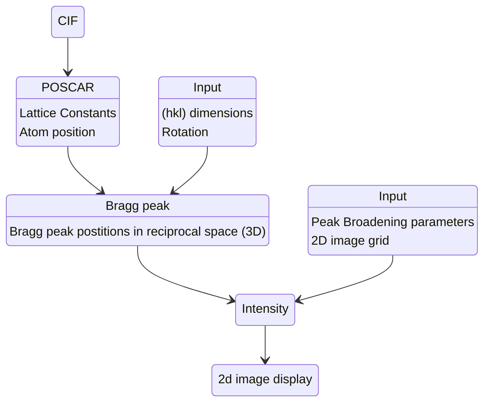

# GIWAXS Simulation tool in Python

Zihan Zhang (zihan.zhang-1@colorado.edu)


A program for 2D material diffraction simulation is introduced in this work. The sample is considered as crystallites with a Gaussian distribution in orientation in spherical coordinate (r,$\theta$,$\phi$). The simulated diffraction pattern is in (q$_x$, q$_{xy}$) plane which is designed to compare with WAXS(wide angle x-ray scattering) measurement. Thus Braggg peaks elongates in a ring pattern from their original positions in reciprocal space.
<figure>
  
  <figcaption>Fig 1. (a) Crystal structure of 2D perovskite; (b) GIWAXS data of PPA; (c) GIWAXS simulation of PPA.</figcaption>
</figure>

## Diffraction Intensity

In reciprocal space, the Gaussian distribution in crystallites orientation results in a rotation for each Bragg peak. If we consider using an area detector to measure the diffraction intensity in q$_z$ q$_{x}$ plane. It is a summation of all Bragg peaks with each of them has the same Gaussian width($\sigma_\theta$, $\sigma_\phi$) centered in (q$_x$, q$_y$, q$_z$):

$$
\begin{equation}
    I(q_z,q_{x})=\sum_{h,k,l}|\sum_{i} f_i(\mathbf{Q}) e^{i\mathbf{Q}\cdot\mathbf{r}_n}|^2 e^{-\frac{1}{2}\frac{(\theta^I-\theta_0^B)^2}{\sigma_\theta^2}}e^{-\frac{1}{2}\frac{(\phi^I-\phi_0^B)^2}{\sigma_\phi^2}}e^{-\frac{1}{2}\frac{(q^I-q_0^B)^2}{\sigma_q^2}}
\end{equation}
$$

where ($q^I$, $\theta^I$, $\phi^I$) is the position of image plane(q$_x$, q$_z$) in spherical coordinate.

<figure>
  
  <figcaption>Fig 2. Spherical Coordinate</figcaption>
</figure>

$$
\begin{equation}
    q=\sqrt{q_z^2+q_{x}^2},\quad \theta=\frac{\pi}{2}-\arctan\frac{q_z}{|q_{x}|}, \quad
    \phi=
    \left\{
    \begin{array}{cc}
        0, \quad x>0\\
        \pi,\quad x<0  
    \end{array}
    \right.
\end{equation}
$$

$\mathbf{Q}$ is the position of Bragg peaks and (hkl) is Miller index. $n$ indicate the atoms in the unit cell and r$_n$ is the real space position of $n$th atom in the unit cell.

$$
\begin{equation}
    \mathbf{Q}=h\mathbf{b}_1+k\mathbf{b}_2+l\mathbf{b}_3
\end{equation}
$$

($q_0^B$, $\theta_0^B$, $\phi_0^B$) is the position of Bragg peaks in reciprocal space converted to spherical coordinates:

$$
\begin{equation}
    q_0^B=|\mathbf{Q}|,\quad\theta_0^B=\arctan\frac{Q_z}{\sqrt{Q_x^2+Q_y^2}},\quad\phi_0^B=\arccos\frac{Q_y}{\sqrt{Q_x^2+Q_y^2}}
\end{equation}
$$

It should be noticed that this is a theoretical result in (q$_z$,q$_x$) plane. Diffraction Ewald sphere is not considered here. Thus there is no 'missing wadge' as it always appears in GIWAXS. And a Gaussion profile in $\hat{q}$ direction is added to make a finite peak width in 2D image plane. In real materials the line shape in $\hat{q}$ is Lorentizian which depends on strain and crystallite size. 

## Bragg Peaks

Although we aim at 2D material in this proposal, a 3D crystal structure is needed to calculate the Bragg peaks. If the position of atoms is described in 2D, we need to assume a lattice constant or d-spacing in z-direction. The single crystal Bragg peaks are calculated from crystal structure file(.cif, POSCAR et. al) where lattice parameters and the positions of atoms in real space are provided. 

=== "POSCAR File"

    ```python
    Sn2 O4
	1.0
	   4.7648180450000002    0.0000000000000000    0.0000000000000003
	   0.0000000000000008    4.7648180450000002    0.0000000000000003
	   0.0000000000000000    0.0000000000000000    3.2074997700000001
	Sn O
	2 4
	direct
	   0.5000000000000000    0.5000000000000000    0.5000000000000000 Sn4+
	   0.0000000000000000    0.0000000000000000    0.0000000000000000 Sn4+
	   0.8059722950000000    0.1940277050000000    0.5000000000000000 O2-
	   0.1940277050000000    0.8059722950000000    0.5000000000000000 O2-
	   0.3059722950000000    0.3059722950000001    0.0000000000000000 O2-
	   0.6940277050000000    0.6940277050000000    0.0000000000000000 O2-
    ```

The unit vector in real and reciprocal space are defined as:

$$
\begin{equation}
\begin{aligned}
    \mathbf{a}_1&=(a,0,0),\quad\quad\quad\quad\quad\quad\quad\quad\quad\quad\,\,\,\,\quad\quad\quad\quad    \mathbf{b}_1=\frac{2\pi}{V}\mathbf{a}_2\times\mathbf{a}_3\\ \mathbf{a}_2&=(b\cos\gamma,b\sin\gamma,0),\quad\quad\quad\quad\quad\quad\,\,\,\quad\quad\quad\quad\mathbf{b}_2=\frac{2\pi}{V}\mathbf{a}_3\times\mathbf{a}_1\\
    \mathbf{a}_3&=(c\cos\beta,cn_2,c\sqrt{\sin^2\beta+n_2^2}),\quad\quad\quad\quad\quad\quad\mathbf{b}_3=\frac{2\pi}{V}\mathbf{a}_1\times\mathbf{a}_2
\end{aligned}    
\end{equation}
$$

where $(a,b,c)$ and $(\alpha,\beta,\gamma)$ are lattice constants and angles of unit cell,

$$
\begin{equation}
    n_2=\frac{\cos\alpha-\cos\beta\cos\gamma}{\sin\gamma}
\end{equation}
$$

$$
\begin{equation}
    V= \mathbf{a}_1\cdot(\mathbf{a}_2\times\mathbf{a}_3)
\end{equation}
$$

We also made a rotation matrix to help adjust the sample orientation if the it is not ideally given by in the crystal structure file:

$$
\begin{equation}
    M=\left(\begin{array}{ccc}
       \mathbf{a}_1\\
        \mathbf{a}_2 \\
        \mathbf{a}_3
    \end{array}\right)=\left(\begin{array}{ccc}
        a & 0 & 0\\
        b\cos\gamma & b\sin\gamma & 0 \\
        c\cos\beta & c n_2 & c\sqrt{\sin^2\beta+n_2^2}
    \end{array}\right)
\end{equation}
$$

$$
\begin{equation}
    \hat{q},\,|\mathbf{q}|,\,\Delta E
\end{equation}
$$

$$
\begin{equation}
    E=\sqrt{m^2c^4+p^2c^2}
\end{equation}
$$

$$
\begin{equation}
    R_x(\theta)=\left(\begin{array}{ccc}
        1 & 0 & 0\\
        0 & \cos\theta & -\sin\theta \\
        0 & \sin\theta & \cos\theta
    \end{array}\right),\quad
    R_y(\theta)=\left(\begin{array}{ccc}
        \cos\theta & 0 & -\sin\theta\\
        0 & 1 & 0 \\
        \sin\theta & 0 & \cos\theta
    \end{array}\right)
\end{equation}
$$

Multiply Matrix M by $R_x(\theta)$ or $R_y(\theta)$ gives the rotated lattice vectors.

Position of Bragg peaks with Miller index (hkl):

$$
\begin{equation}
    \mathbf{G}=h\mathbf{b}_1+k\mathbf{b}_2+l\mathbf{b}_3
\end{equation}
$$
<!-- 
<figure>
  
  <figcaption>Fig 3. Workflow of this program.</figcaption>
</figure> -->

Workflow of this program:


[Download](https://github.com/ZihanZhang-1996/2D_diffraction) the source code.

=== "Code"

    ```python
    import numpy as np
	import diffraction as diff
	import matplotlib.pyplot as plt
	import matplotlib.cm as cm
	import time as time
	from matplotlib.widgets import Button
	import scipy.io
	from matplotlib.widgets import RangeSlider
	import scipy.ndimage as ndimage
	import matplotlib.patheffects as path_effects
    ```

=== "Set the parameters"

    ```python
    # use thetax and thetay to adjust initial orientation of the sample
	thetax=np.pi/2*1
	thetay=np.pi/2*0
	hkl_dimension=10

	# sigma_theta, if you need a small number for single crystal, input~0.01, 
	# if you need infinity, input~1000
	sigma1=0.02

	# sigma_phi
	sigma2=1000

	# sigma_r, use this to tune the peak linewidth
	sigma3=0.01

	# settings for imagine plane
	resolutionx=300
	qxymax=2.5
	qzmax=3
	qzmin=0

	resolutionz=int(resolutionx/qxymax*qzmax)
	gridx,gridz=np.meshgrid(np.linspace(-qxymax,qxymax,resolutionx),np.linspace(qzmin,qzmax,resolutionz))
    ```

=== "Read CIF"

    ```python
    # read crystal structure from POSCAR
    # POSCAR file which can be easily converted from cif on VESTA (fractional coordinate)
	dirr = ''
	filename = 'MA2DMF2Pb3I8_Petrov2017'
	address = dirr + filename +'.vasp'
	a1,a2,a3,positions=diff.read_poscar(address) # example (graphite)
	Bpeaks,Mqxy,Mqz,I_miller = diff.Braggg_peaks(a1,a2,a3,positions,thetax,thetay,hkl_dimension)
    ```

=== "Simulation"

    ```python
    t1_start = time.process_time()
	# calculated GIWAXS pattern
	III=diff.intensity(gridx,gridz,Bpeaks,sigma1,sigma2,sigma3,hkl_dimension)
	t1_stop = time.process_time()
	print('cpu time =')
	print(t1_stop-t1_start,'s')
    ```

=== "Plot"

    ```python
     # make the plot
	colorbar=0.5   # upper limit
	    
	# II1=np.log(III+1)

	II1=III

	fig,ax=plt.subplots(figsize=(14,14))

	plt.imshow(II1, interpolation='nearest', cmap=cm.jet,
	               origin='lower', extent=[-qxymax, qxymax, qzmin, qzmax],
	               vmax=colorbar*II1.max(), vmin=II1.min())
	ax.set_xlabel('q$_{xy}$(1/A)',fontsize=16)
	ax.set_ylabel('q$_{z}$(1/A)',fontsize=16)
	ax.set_title(filename+' GIWAXS simulation',fontsize=16)
	fig.set_size_inches([17,10])
    ```
