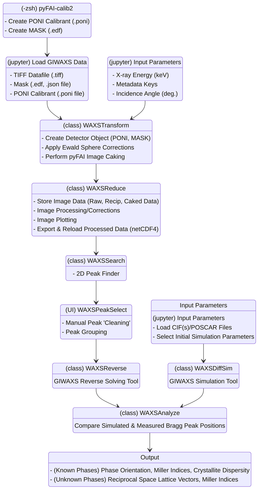
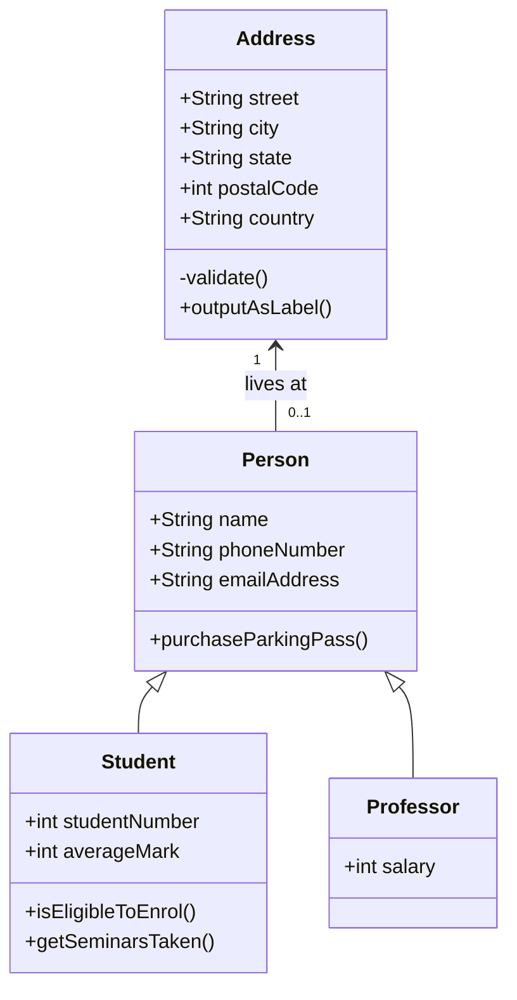

# pyWAXS

### pyWAXS: Our group's Python-based GIWAXS data reduction and analysis package.
We intend for this module to include working UI (user interface) deployable executable(s) to assist with 2D GIWAXS data reduction, peak search & analysis, WAXS image simulation from (CIF/POSCAR) files, and reverse GIWAXS problem solving capabilities.

### Program Structure
<!-- See [Instruction](https://squidfunk.github.io/mkdocs-material/reference/diagrams/). -->

### pyWAXS Development Task List
  - [ ] Zihan
      - [ ] 0. (Create Method) in WAXSReduce.py Subclass 'Integration1D(WAXSReduce)': Direct azimuthal integrator on reciprocal space map (no caking or pixel splitting). Integration will rely on data assignment for masked positions (NaN v. '0' v. '-1') - see Keith's 'Task 0'.
      - [ ] 1. (Update Method) in WAXSReduce.py 'WAXSReduce' Class Method 'sinchi_corr': Review and update method 'sinchi_corr' used for sin(chi) correction. Check on usage and physical sample requirements for applying q^2 term. Check on application of sin(chi) correction factor in existing method.
      - [ ] 2. (Algorithm Development/Update/Create Class Methods) in WAXSReverse.py 'WAXSReverse' Class: Create functional class methods for WAXSReverse brute force solver workflow to be implemented in a Jupyter notebook. Notebook user should be able to reloaded peak sets stored as netCDF4 (h5netcdf) files from WAXSPeakSelect.py UI exports (peak position, caked image, reciprocal space map xarray Datasets). See Keith task bullet points 1 & 2.
      - [ ] 3. (Create Method) in  WAXSReduce.py Class 'ImageInterpolator': Create a new Fourier transform class method for the image interpolation class that is presently saved in the WAXSReduce.py script.
  - [ ] Keith
      - [ ] 0. (Confirm Implementation): Check WAXSReduce Class methods, are mask regions being stored as '0', '-1', None, or NaN values in the DataArray/DataSets being stored as class attributes.
      - [ ] 1. (Create Class Methods) in WAXSPeakSelect.py Classes: Create class methods to export a netCDF4 (h5netcdf) file from an active UI experiment session. User will be able to add/remove peaks from peak search outputs and export these peaks to a reloadable file format to the WAXSReverse.py 'WAXSReverse' Class.
      - [ ] 2. (Create Class Methods) in WAXSReverse.py 'WAXSReverse' Class: Create a netCDF4 (h5netcdf) file loader for outputted Xarray DataSets to load sets of reduced data and paired peak positions from WAXSPeakSelect.py UI exports.
      - [ ] 3. (Create Method) in WAXSPeakSelect.py MyCanvas(FigureCanvas) Class Method(s): Display Sliced ROI selection from DataArray for Integration1D(WAXSReduce) subclass method connections in UI.
      - [ ] 4. (Update Documentation): (README) for local environment installation using Conda installation and mounted 'pyWAXS.yml' file. 
      - [ ] 5. (Add Documentation): Add a folder 'example' that contains example data/PONI/MASK/POSCAR files for data analysis.
      - [ ] 6. (Update Method): Fix highlighting tool in WAXSPeakSelect.py UI, add (X) box.
      - [ ] 7. (Create Method/Widget): Add an interactive table in WAXSPeakSelect.py UI to view selected/highlighted peaks in a group within a table.
      - [ ] 8. (Create Method/Widget): Add buttons to 'Group' peaks in WAXSPeakSelect.py and select qxy, qz layer line binning in secondary table (later task).
      - [ ] 9. (Create Method/Widget): Add method to load a CIF/POSCAR filepath as attribute into WAXSSim window.
      - [ ] 10. (Update Methods): Update 'WAXSSim' class methods to work using Xarray Datasets, we will use sets of chunks to store our data. Each chunk will contain:
          - (1) DataArray: Normalized Intensity values mapped to boolean array in (2)
          - (2) DataArray: Integer boolean array for Bragg Peak positions mapped to intensity array dimensions
          - (3) Attributes: Values of theta_x, theta_y, hkl_extent, sigma_theta, sigma_phi, sigma_chi, resolution, CIF file, DOI reference
          - Within the DataSet, we will store multiple DataArrays that each correspond to a different simulation. Should we store the simulation results with respect to an access CIF/POSCAR file?
          - (Algorithm Development): Is it possible to use singular value decomposition (SVD) in conjunction with simulating a lower resolution/dimensionality 2D GIWAXS image to improve image quality to high resolution simulations while retaining the effective computational efficiency of the low resolution simulation?
      - [ ] 11. (Create Method/Widget): Add a second interactive table in WAXSPeakSelect.py UI to view selected/highlighted grouped/ungrouped peaks, and peaks assigned to a CIF/POSCAR filepath.
      - [ ] 12. (Update Method) in WAXSReduce.py 'WAXSReduce' and 'Interpolation1D(WAXSReduce)' Class methods: Update formatting in WAXSReduce plotting methods to have LaTeX axis labels. Requires aliasing for different plotting coordinate options.
      - [ ] (Algorithm Development) in WAXSSearch.py: Explore usage of intensity-weighted K-Dimensional Tree binary clustering routine in WAXSSearch 2D peak finding routine.

An example of class diagram:

An example of the table:

| Method      | Description                          |
| ----------- | ------------------------------------ |
| `GET`       | :material-check:     Fetch resource  |
| `PUT`       | :material-check-all: Update resource |
| `DELETE`    | :material-close:     Delete resource |